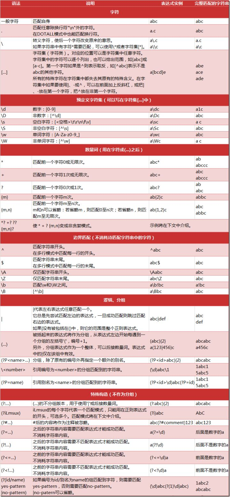

# **语法如图所示:**

### **重点总结:**

1. 中括号: **逐个列举**的作用, 可以用连字符表示一个范围, 第一个位置可以取保留字意义, 如果是^表示将其后一串字符取非, 其他位置则一律是字符本义(没有赋予特殊表达或象征含义); 所以要使用象征含义可以使用反斜杠"\"致使系统识别起作用
2. 小括号: 被括起来的字符作为一个分组, 会依次从1开始由左至右编号
3. 大括号: 表匹配前一个字符(串)的次数
4. ?: 匹配前一个字符(串)的0或1次, 可以有效防止贪婪匹配(如: *?; +?; {m,n}?)
5. \数字: 引用分组字符串(数字即某个位置的小括号的数字编号, 再重用它内部的字符串于\数字出现处)
6. ?P<别名>: 给其后字符起别名组别(非数字式)
7. ?P=别名: 以别名方式调用组别字符串
8. (?:字符串1|字符串2): 不分组, 但是可以表达多个或的匹配含义
9. (?#注释): 忽略注释部分内容
10. (?<=前移字符串): 前面的字符要符合这个前移字符串(记忆: <=表示往前推进一位, 所以是前置匹配)
11. (?=之后串): 之后的字符要符合这个之后串(记忆: 不用指明方向则默认是后置匹配)
12. (?!字符串): 之后的字符要不符合这个串通过
13. (?<!): 同上
14. (?(组名)yes时再匹配串|no时再匹配串): 当引用组的匹配能发生(或者不成功)时,  还需要匹配的东西是yes(或no)串, 两者都符合才算整体匹配成功.

